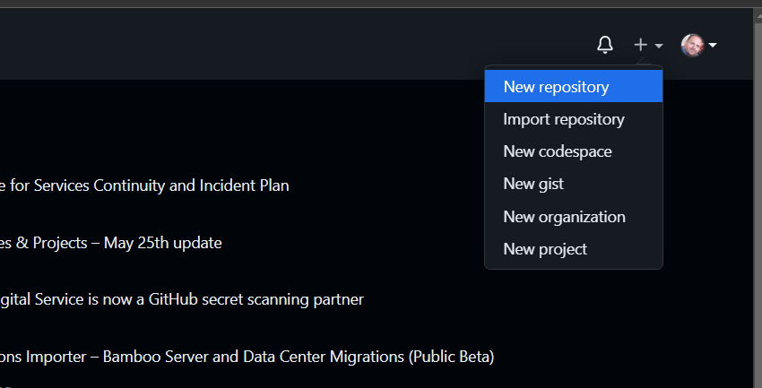

# Uploading your Streamlit app to GitHub

## GitHub

Git is a version control software that tracks changes made to collection of code and/or documents. 
This collection is called a "git repository" or "repo" for short. 
GitHub is a well-known website where you can manage and share your git repositories either publicly or privately.

You can also use GitHub to host your Streamlit app for others to see. Follow the directions below to see how. 

## Sign up for GitHub

Firstly, sign up for a [GitHub](https://github.com/) account.

## Create a GitHub repository

Follow the following steps to create a GitHub repository:
- In the top right hand corner, click on the **"+"** icon which should reveal a drop-down menu, then click on 
**"New repository"**.

- This should bring to a new webpage called **"Create a new repository"**. Under the **"Repository name"** field, 
enter a name for your repository, for example, `AIM-2023-Share`.
- Under the **"Initialize this repository with:"** field, tick on **"Add a README file"**.
- Finally, click on **"Create repository"**.

## Upload files to the GitHub repo

Slightly above the file table and adjacent to the green **Code** button, click on **Add file** > **Upload files**.

This will bring you to a new webpage where the central box says ***Drag files here to add them to your repository*** and **choose your files**, which you can either drag-and-drop files into this box or click on the **choose your files** link to choose files from your local computer.

Click on **Commit changes** to proceed further.

# Deploying your Streamlit app with Streamlit Community Cloud

## Streamlit Community Cloud

[Streamlit Community Cloud](https://streamlit.io/cloud) is a hosting service for easily deploying Streamlit apps.

## Sign up for Streamlit Community Cloud

You can easily sign up for [Streamlit Community Cloud](https://streamlit.io/cloud) by simply logging in with Google or GitHub account.

## Deploy a Streamlit app

To deploy a Streamlit app, do the following:
1. Sign in with GitHub or Gmail credentials
2. Pick a repo, branch and file
3. Click Deploy

Then any time you do a git push your app will update immediately.
